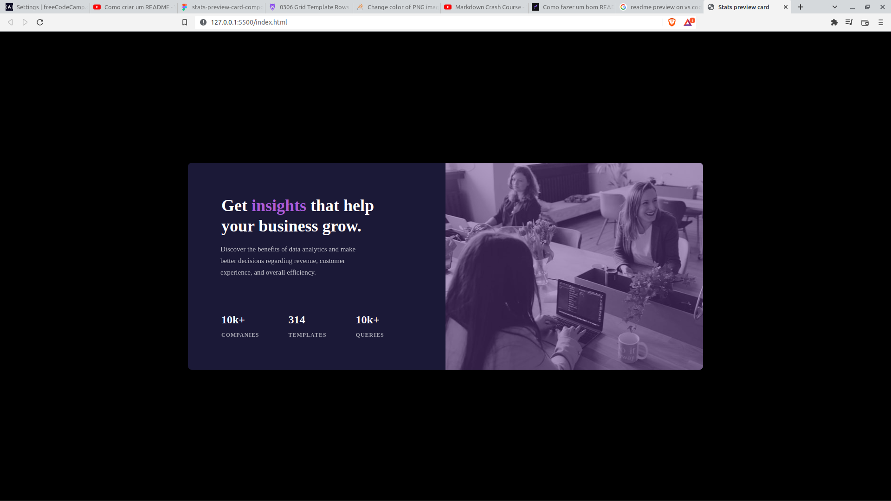

<h1 align="center">Desafio-Frontend Mentor - Stats preview card component</h1>

Projeto básico do frontendmentor realizado para treinar html,css e design responsivo. 🚧  🚀 Em construção...  🚧 ...

<h1 align="center"> Tecnologias </h1>

    <ul>
        <li>HTML 5</li>
        <li>CSS 3</li>
        <li>Media Queries</li>
    </ul>

<h1 align="center">Imagens</h1>
